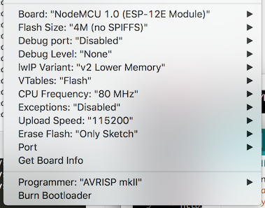

# ESP8266 Temperature/Humidity/Pressure IOT Device

This is a IOT device that transmits temperature, humidity, and pressure data from a
BME280 to Adafruit's IOT data service, [Adafruit IO](https://io.adafruit.com).

## Hardware

   * ESP8266 Board
   * BME280

### Wiring

| ESP8266 | BME280 |
|---------|--------|
| 3V3     |    VCC |
| GND     |    GND |
| D1      |    SCL |
| D2      |    SDA |


## Compile/Upload

```
git clone git@github.com:onebytegone/iot_esp8266_bme280_adafruitio.git
cd iot_esp8266_bme280_adafruitio
```

Open `iot_esp8266_bme280_adafruitio.ino` in the Ardunio IDE.

Most likely you will want to edit the following fields in `config.h`.

   * `IO_USERNAME`: This is your username on [io.adafruit.com](https://io.adafruit.com)
   * `IO_KEY`: The AOI key for your account (See [this][adafruit-aoi-key] for more info)
   * `IO_HUMIDITY_FEED`: The key for the humidity sensor on [io.adafruit.com](https://io.adafruit.com)
   * `IO_TEMPERATURE_FEED`: The key for the temperature sensor on [io.adafruit.com](https://io.adafruit.com)
   * `IO_PRESSUE_FEED`: The key for the pressure sensor on [io.adafruit.com](https://io.adafruit.com)
   * `NETWORK_SSID`: The name for your WiFi network
   * `NETWORK_PSK`: The password for your WiFi network

[adafruit-aoi-key]: https://learn.adafruit.com/welcome-to-adafruit-io/libraries#usage-6-10

### Board Definitions

The board definition for the ESP8266 is available via the Boards Manager in the Arduino
IDE (Tools > Board > "Boards Manager...")

   * https://github.com/esp8266/Arduino

### Libraries Needed

The following libraries need to be installed to build the source code. These are available
via the Library Manager in the Arduino IDE (Sketch > Include Library > "Manage
Libraries...")

   * https://github.com/adafruit/Adafruit_Sensor
   * https://github.com/adafruit/Adafruit_BME280_Library

### Build Configuration

These settings will vary based on your board. The photo below contains the configuration I
used, mainly for posterity sake.




## License

This is released under the MIT license. See [LICENSE.md](LICENSE.md) for more information.
